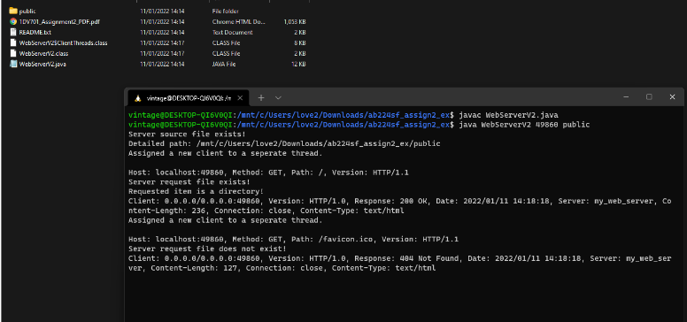

# HTTP Server for course 1DV701

## Assignment instructions

### Problem 1
Implement a simple web server that accepts multiple client connections on some port (e.g., 8888) using the `ServerSocket` class. The server should serve (at least) HTML and PNG files from a local directory, using the `GET`
method in the HTTP protocol.

The response from the server should include correct and relevant headers as well as the requested file. The
server should run until you terminate it (ctrl-c or ctrl-d keyboard shortcut).

*Program requirements:*

- Two program arguments in the specified order
  - The port (listening port)
  - Relative path to `/public` directory. (Do NOT use absolute paths)
- You are not allowed to use third-party libraries or existing Java classes (such as `com.sun.net.httpserver` )
since these make the problem trivial.
- Console output from the program should provide useful debugging information and in general make
sense. Eg. connections being established and content served is a good idea to display.
- Use the provided public folder.
- Use the provided python test script to check if your implementation works as expected.

*Note: What is the `/public` directory?*

Think of this folder as the serving directory from which our webserver will serve html files and images.
Accessing `http://yourip:port/stuff.html` should serve the file from `your_project_folder/public/stuff.html`.

*Note: Using the command line*

Your assignment is going to be tested via the command line, it will not be ran via an editor/IDE. Note that this
means you should verify that everything works correctly via the command like. If you are on Windows, WSL is
recommended to use here as to get into a Linux environment for more convenient testing. Java also exists for
powershell/cmd. Compiling is done via the command `javac` while the actual class is ran using the `java`
command.

*Note: An example of someone doing it right*

The following image represents someone that has fully completed this problem (and a small part of P2) and
has provided all the parts necessary to get full marks. Take note of the document structure of the submission
(visible in the file explorer) and the way compiling and running the solution works. Take special note of where
the `.java` main file is in relation to the public folder.

*How to start:* 

Start by implementing a server that accepts connections and returns a predefined (valid)
HTTP/HTML response. Once you can connect to the server with a web browser and view the predefined HTML
page, you should add support for reading HTML files from disk and returning these. Finally, add support for
images (binary files). If a user requests a specific directory, e.g. `/` or `user1/pages` and this directory contains
`index.html` file, then this file should be returned. Note that the ending / is optional, so
`http://myserver.com/user1` and `http://myserver.com/user1/` should both return the `index.html` file in the user1
directory. Prepare a few HTML and PNG files in a directory hierarchy (e.g. /memes/rarepepe.png ) and use this
to test your web server. Make sure to include both index.html files as well as other named HTML files, e.g.,
myfile.html . Your report should include screenshots of the browser window when you request a named HTML
page, an image, and a directory (with an index.html file).

Your web server should be robust -- you have to handle possible exceptions. Document which exceptions
you handle and why. Do NOT allow a user to escape the public directory and access other files on the
computer.

### Problem 2
The web server you implemented in Problem 1 only supports the HTTP response 200 OK . You should now
add support for the following response types:
- 302
- 404
- 500

When implementing 302, hardcode a specific url that redirects to any resource of your choosing. Include a
description of how you tested each of these response codes with screenshots of the result in your report.
Include in the instruction text file how to trigger each of these.

**VG Problem** 

Add support for the HTTP POST method. Add a webpage with a form that allows a user to
upload PNG images somewhere in your directory hierarchy. We recommend implementing a multipart-form
parser.
