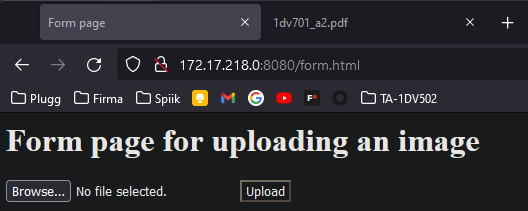
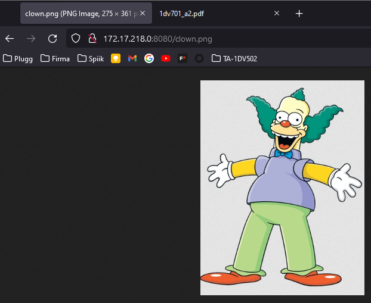
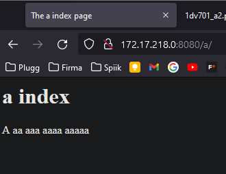
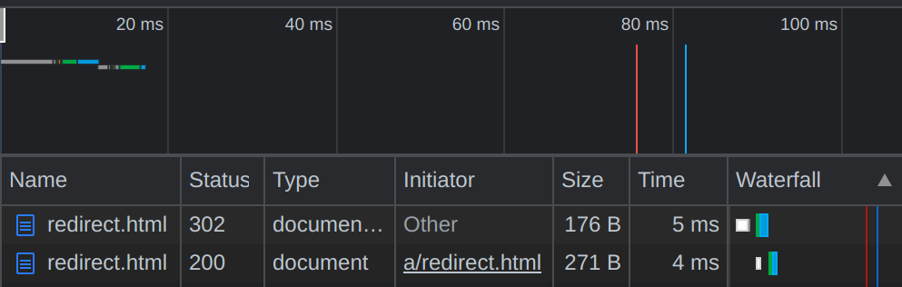
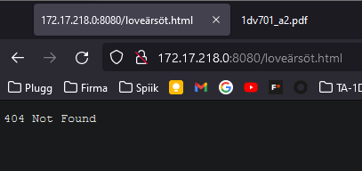
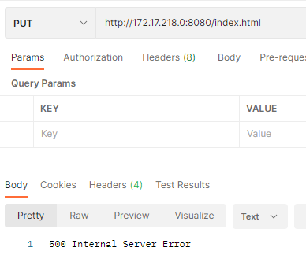

# Assignment 2  
## 1DV701

Author: Christoffer Eid  
Author: Olof Enström  
Semester: Spring 2022  
Email: ce223af@student.lnu.se  
Email: oe222fh@student.lnu.se

---
## Table of contents
- [Assignment 2](#assignment-2)
  - [1DV701](#1dv701)
  - [Table of contents](#table-of-contents)
  - [Problem 1](#problem-1)
    - [Exceptions](#exceptions)
      - [FileNotFoundException](#filenotfoundexception)
      - [IllegalArgumentException](#illegalargumentexception)
      - [SocketException](#socketexception)
      - [IOException](#ioexception)
  - [Problem 2](#problem-2)
    - [302 Redirect](#302-redirect)
    - [404 Not Found](#404-not-found)
    - [500 Internal Server Error](#500-internal-server-error)
  - [VG](#vg)

## Problem 1
  
awdawd

  
awdawd

  

### Exceptions
#### IllegalArgumentException
During the POST if an unsupported filetype is uploaded a BAD REQUEST HTTP status will be sent. This exception is thrown by `FileType.fromString()`. 

#### IOException
If an Input output error ever occurs during the course of the thread or the main program an error message will be printed. In the case of the thread the socket, output/input streams and thread itself will be closed. 

#### NumberFormatException
If the first argument; ´port number´ does not contain a parsable Integer an error message is printed and the program shuts down. 

## Problem 2
### 302 Found
  
Navigating to the URL `/a/redirect.html` the `302 Found` response code will be triggered with a `Location` header containing `/redirect.html`. This redirects you to `/redirect.html` with a `200 OK` response.

### 404 Not Found
  
The `404 Not Found` response code is triggered by making a request to any file or directory that does not exist in the `public` folder.

### 500 Internal Server Error
  
Make any request other than the supported `GET` or `POST` and the 500 Internal Server Error will be triggered.

## VG
For the image parsing we are looking for the specific start bytes of any supported image formats (PNG and JPG currently). This indicates the start set of bytes to write to the image. We then do the same for the end bytes. To look for the start and end sequence we use an algorithm for pattern matching. At first we wrote our own algorithm. However, due to bad performnence, we ended up using the [Knuth-Morris-Pratt algorithm](https://stackoverflow.com/a/1507813).